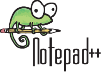
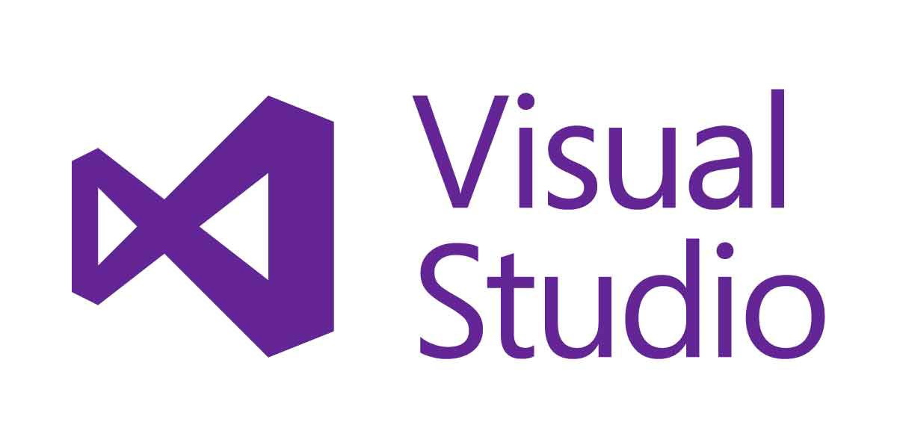
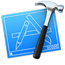

<a href="..">&lt;&lt; Back to main site</a>

# Developer Tools

The following is a compiled, non-exhaustive list of tools that can help with the development process.  Some of these are language-specific, while others are more general.

<table>
  <tr>
    <td><b>Tool</b></td>
    <td><b>Description</b></td>
  </tr>
  <tr>
    <td></td>
    <td><a href="https://developer.android.com/studio/">Android Studio</a> 
    Official IDE for building Android apps.  Includes intelligent code completion, debugging, emulators, and more.  Not for general Java development.
    <ul>
      <li>Java</li>
      <li>Kotlin</li>
    </ul></td>
  </tr>
  <tr>
    <td></td>
    <td><a href="https://atom.io">Atom</a> 
    An open-source text editor (sponsored by GitHub) with intelligent code colorization, word completion, extensions, and cross-platform support.  Integrates with Git and Github.</td>
  </tr>
  <tr>
    <td></td>
    <td><a href="https://www.eclipse.org/downloads/packages/">Eclipse</a> 
    IDE for Java programmers, with intelligent code completion and analysis, compiling, debugging, and build features.  Requires a complex filesystem to operate correctly.</td>
  </tr>
  <tr>
    <td></td>
    <td><a href="https://github.com/">GitHub</a> 
    Website that hosts software version control, and has dozens of features to improve the software development process.</td>
  </tr>
  <tr>
    <td></td>
    <td><a href="https://desktop.github.com/">GitHub Desktop</a> 
    Client-side program that pushes and pulls commits to and from GitHub over HTTPS or SSH while you develop locally.</td>
  </tr>
  <tr>
    <td></td>
    <td><a href="https://www.jgrasp.org/">jGRASP</a> 
    Lightweight IDE for Java development; includes a source code editor, compiler, and debugger.</td>
  </tr>
  <tr>
    <td></td>
    <td><a href="https://notepad-plus-plus.org/">Notepad++</a> 
    Basic text editor with support for code colorization, word completion, and workspaces.  Contains optional extensions for added functionality.  Not especially versatile as an IDE.</td>
  </tr>
  <tr>
    <td></td>
    <td><a href="https://visualstudio.microsoft.com/">Visual Studio</a> 
    Microsoft's full proprietary IDE designed for Azure developers.  Includes full IDE functionality including integrations with GitHub and other collaborative tools.</td>
  </tr>
  <tr>
    <td></td>
    <td><a href="https://code.visualstudio.com/">Visual Studio Code</a> 
    Microsoft's open-source IDE with intelligent code completion and suggestions, extensions, a built-in terminal, debugging, and cross-platform support.  Integrates with Git and Github.</td>
  </tr>
  <tr>
    <td></td>
    <td><a href="https://developer.apple.com/xcode/">Xcode</a> 
    Apple's IDE for iOS and macOS development, with a focus on the Swift programming language.  Requires registration as an Apple developer to download.<ul>
      <li>Swift</li>
</ul></td>
  </tr>
</table>
