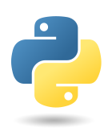
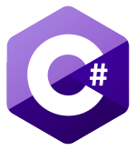

# Welcome

This website contains links to various resources to help beginner programmers learn how to code in many different languages using numerous online tools.  The content listed here is definitely not exhaustive, and you are encouraged to explore on your own.

## Languages

<table>
  <tr>
    <td><b>Language</b></td>
    <td><b>Logo</b></td>
    <td><b>Language Type</b></td>
    <td><b>Description/Purpose</b></td>
  </tr>
  <tr>
    <td>Python</td>
    <td></td>
    <td>Programming Language</td>
    <td>Very popular general purpose interpreted programming language.  Great for complete beginners.  Works on all platforms.</td>
  </tr>
  <tr>
    <td>Java</td>
    <td></td>
    <td>Programming Language</td>
    <td>Popular general purpose interpreted programming language.  Tested on the AP Computer Science A exam.</td>
  </tr>
  <tr>
    <td>C++</td>
    <td></td>
    <td>Programming Language</td>
    <td>Extremely powerful low-level general-purpose compiled programming language.  Allows the developer to directly control allocation and freeing of memory.</td>
  </tr>
  <tr>
    <td>HTML</td>
    <td></td>
    <td>Markup Language</td>
    <td>Universal language used to render the content of web pages.</td>
  </tr>
  <tr>
    <td>CSS</td>
    <td></td>
    <td></td>
    <td>Universal language used to render the styling of web pages.</td>
  </tr>
  <tr>
    <td>JavaScript</td>
    <td></td>
    <td>Scripting Language</td>
    <td>Widespread language used to create interactive elements on web pages.  Implemented slightly differently on every browser.  Systems such as Google Apps Script are based on Javascript's syntax.</td>
  </tr>
  <tr>
    <td>C#</td>
    <td></td>
    <td>Programming Language</td>
    <td>Microsoft's language used by .NET developers to create a wide variety of Windows applications.  Very easy to learn after C++ and Java.</td>
  </tr>
  <tr>
    <td>Node.js</td>
    <td></td>
    <td></td>
    <td></td>
  </tr>
  <tr>
    <td>C</td>
    <td></td>
    <td></td>
    <td></td>
  </tr>
  <tr>
    <td>PHP Web Server</td>
    <td></td>
    <td></td>
    <td></td>
  </tr>
  <tr>
    <td>Ruby</td>
    <td></td>
    <td></td>
    <td></td>
  </tr>
  <tr>
    <td>Go</td>
    <td></td>
    <td></td>
    <td></td>
  </tr>
  <tr>
    <td>jQuery</td>
    <td></td>
    <td>Library</td>
    <td>A JavaScript library specifically designed to make scripting in JavaScript easier.  Creates more intuitive syntax, with well-delineated selectors, actions, and properties.</td>
  </tr>
  <tr>
    <td>Swift</td>
    <td></td>
    <td>Programming Language</td>
    <td>A language designed by Apple, Inc. for the development of iOS and macOS applications.  Best used with Apple's Xcode IDE.</td>
  </tr>
  <tr>
    <td>Kotlin</td>
    <td></td>
    <td>Programming Language</td>
    <td>An alternative to Java for building apps on the Android platform.  Used in thousands of published Android apps.</td>
  </tr>
  <tr>
    <td>Google Apps Script</td>
    <td></td>
    <td>Scripting Language</td>
    <td>Google's special server-side JavaScript that allows Google users to programmatically control Google services.  Requires a Google account, but no additional setup is required.</td>
  </tr>
  <tr>
    <td>MySQL</td>
    <td></td>
    <td></td>
    <td></td>
  </tr>
  <tr>
    <td>R</td>
    <td></td>
    <td></td>
    <td></td>
  </tr>
</table>
